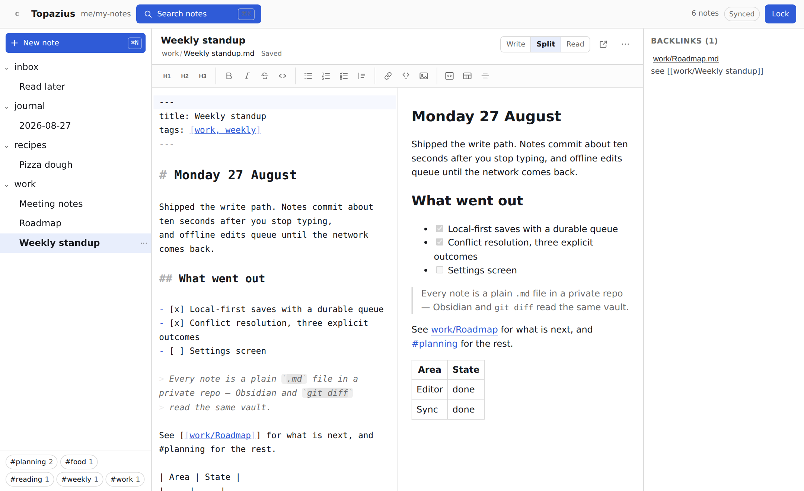
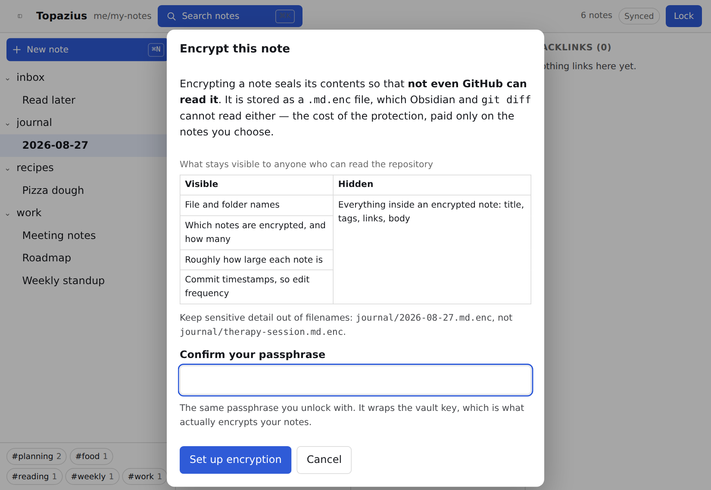

<div align="center">

# Topazius

**A markdown notes app whose database is a private GitHub repository you own.**

No server. No account. No third party. It runs entirely in your browser and talks
to `api.github.com` with a token that never leaves your device.

[](https://github.com/mutkuoz/topazius/actions/workflows/ci.yml)

<picture>
  <source media="(prefers-color-scheme: dark)" srcset="docs/media/topazius-dark.png">
  
</picture>

</div>

---

## The idea

Your notes are `.md` files in a private repo. Not a proprietary database, not a
sync service's copy of your data — files, in folders, in git.

That single decision is what everything else follows from. The same vault opens
in Obsidian, in vim, in `git clone`. Every edit is a commit, so history and
recovery are git's problem, already solved. And because a static page can talk
to the GitHub API directly, there is no backend to run, to trust, or to pay for.

Topazius is a good way to work on that vault from a browser — including a phone —
not a place your notes live.

## What it does

**Writes.** A markdown editor that styles as you type: headings scale, emphasis
shows, and the syntax markers dim until your cursor reaches them. The file on
disk is exactly what you typed, byte for byte. A toolbar covers headings, bold,
italic, strikethrough, code, lists, task lists, quotes, links, tables and
dividers.

**Saves without being asked.** Every keystroke lands in local storage
immediately; a commit follows about ten seconds after you stop typing, or at
once with `⌘S`. Typing never waits on the network — write on a plane, and the
queue empties when you land.

**Organises.** Folders are folders. Create, rename, move and delete notes from
the tree or the palette; links between notes are rewritten when something moves.

**Finds.** `⌘K` opens one box for everything: fuzzy quick-open by name, full-text
search across every note, and the app's commands. Tags come from frontmatter and
from `#inline` tags; `[[wikilinks]]` resolve by name and produce a backlinks
panel.

**Takes images.** Paste or drop one and it is downscaled, named by its content
hash, committed under `assets/`, and linked at your cursor.

**Encrypts what needs it.** Any single note can be sealed so that not even
GitHub can read it — with a recovery key, so a forgotten passphrase is
survivable. The rest of your vault stays plain markdown.

**Installs.** Add it to your home screen or dock; cached notes are readable
offline, and edits queue until you reconnect.

**Locks itself.** After 15 minutes idle, or 5 minutes hidden, or whenever you
press `⌘L`. Your token and your keys leave memory when it does.

## How it works

Two repositories, because GitHub Pages cannot serve from a private repo on a
free account:

```
  github.com/<you>/topazius            github.com/<you>/my-notes
  PUBLIC — the app, no secrets         PRIVATE — your notes
  ┌────────────────────────────┐       ┌────────────────────────────┐
  │ src/                       │       │ inbox/idea.md              │
  │ .github/workflows/         │       │ work/standup.md            │
  └─────────────┬──────────────┘       │ journal/aug.md.enc         │
                │                      │ assets/2026/08/pic-a1b2.png│
                ▼                      └────────────────────────────┘
     GitHub Pages (static)                          ▲
     https://<you>.github.io/topazius               │
                │                                   │
                └──── your browser, with your token ┘
                              api.github.com
```

The public fork holds only code — there is nothing secret in it. Your notes live
in the private one. Your token stays in your browser, encrypted at rest under
your passphrase.

## Setup

About five minutes, once.

### 1 · Fork this repository

Use the **Fork** button, and keep the fork **public** — it holds no secrets, and
a public fork is what lets Pages serve it for free.

### 2 · Turn on Actions and Pages

Both are off by default on a fork.

- **Settings → Actions → General** → *Allow all actions and reusable workflows* → **Save**
- **Settings → Pages** → *Build and deployment* → **Source: GitHub Actions**

Then **Actions → Deploy → Run workflow**. When it finishes, your app is at
`https://<your-username>.github.io/topazius/`.

> [!NOTE]
> The Pages step cannot be automated: the workflow's built-in token is not
> allowed to create a Pages site, so the first run fails with *"Get Pages site
> failed"* until you set that Source yourself.

### 3 · Make a private repo for your notes

A new **private** repository — `my-notes` is a fine name. It can be completely
empty; Topazius will write the first note.

> [!WARNING]
> Do not put your notes in the fork. The fork is public.

### 4 · Create a fine-grained token

At **[github.com/settings/personal-access-tokens/new](https://github.com/settings/personal-access-tokens/new)**:

| Setting | Value |
|---|---|
| Repository access | *Only select repositories* → your notes repo, nothing else |
| Permissions → Repository | **Contents: Read and write** |
| Everything else | leave alone |
| Expiry | whatever you are comfortable with |

A **classic** token would reach every repository in your account. Topazius
accepts one but warns you, because a fine-grained token limited to a single repo
is far safer if it ever leaks.

### 5 · Connect

Open your app URL and enter the repository owner, the repository name, your
token, and a passphrase of at least 10 characters.

> [!IMPORTANT]
> The passphrase encrypts your token on this device and **cannot be recovered**.
> Forget it and you enter a new token and pick a new passphrase — your notes are
> untouched either way, because they live in GitHub. (This changes the moment you
> encrypt a note: see [Encryption](#encryption).)

## Using it

### Writing

Press `⌘N`, give the note a title, pick a folder. There is no path to type and no
`.md` to remember — *Weekly standup* in *work* becomes `work/Weekly standup.md`,
and the dialog shows you that before it creates anything. Renaming and moving are
the same two fields.

The bar above the editor tells you where you are: the note's title, its folder as
clickable breadcrumbs, whether it is encrypted, and whether it has reached GitHub
yet. Beside it, a **Write / Split / Read** switch, a link to the file on GitHub,
and a menu with rename, encrypt, delete, and a link to the note's history on
GitHub.

Commits are named after what they did: `Update work/standup.md`,
`Create recipes/pizza.md`, `Delete inbox/old.md`.

> [!TIP]
> Markdown has no paragraph alignment, so the toolbar has no alignment button —
> faking it with raw HTML would be stripped by the sanitizer and unreadable in
> Obsidian. Alignment in markdown is per table column, in the `| --- |` row the
> table button writes for you.

### Finding

`⌘K` opens one box for all of it:

| Type this | To get |
|---|---|
| anything | Quick-open by name, or search the full text of every note |
| `>` | The app's commands |
| `#` | Notes with a tag |
| `enc:` | Every encrypted note |

The tag bar under the tree filters it. `[[wikilinks]]` resolve by full path or by
unique filename; a link to a note that does not exist yet renders muted and
offers to create it.

### Images

Paste, drop, or use the toolbar. Images over 1600px or 1MB are downscaled,
named `assets/YYYY/MM/<name>-<hash>.png`, and linked at your cursor. The same
image pasted twice reuses the first upload. Because your repo is private, images
cannot load by URL — the app fetches and decrypts them itself.

### Encryption

<div align="center">
  
</div>

Open a note's **…** menu → **Encrypt this note**. The first time, the app
generates a **vault key**, wraps it under your passphrase, and shows you a
**recovery key** exactly once. Store it: once a note is encrypted, a forgotten
passphrase would otherwise destroy it.

An encrypted note becomes `<name>.md.enc` and holds ciphertext only your
passphrase or recovery key opens. Inside the app it behaves like any other note —
searchable, linkable, editable — because it is decrypted in memory at unlock.
Outside the app it is unreadable, which is the whole point and the whole cost.

What stays visible to anyone who can read the repository:

| Visible | Hidden |
|---|---|
| File and folder names | Every encrypted note's title, tags, links and body |
| Which notes are encrypted, and how many | |
| Roughly how large each note is | |
| Commit timestamps, so edit frequency | |

So keep the secret out of the filename: `journal/2026-08-27.md.enc`, not
`journal/therapy-session.md.enc`.

### When things collide

If a note changed on GitHub while you were editing it — another device, a commit
from your laptop — the save is refused rather than forced. Topazius shows both
versions side by side with the changed lines marked and asks: keep mine, keep
theirs, or merge by hand. Nothing is resolved silently.

### Keyboard

| Key | Does |
|---|---|
| `⌘K` / `⌘⇧F` | Palette: quick-open, search, commands |
| `⌘N` | New note |
| `⌘S` | Commit now |
| `⌘P` | Editor only ⇄ editor and preview |
| `⌘B` / `⌘I` | Bold, italic |
| `⌘L` | Lock |
| `Esc` | Close a dialog |

### Your vault is your folders

Any `.md` (or `.md.enc`) file in any folder appears in the tree. Two directory
names are reserved and hidden: `assets/` and `.topazius/`.

Notes may carry YAML frontmatter, read for the title and tags:

```markdown
---
title: Standup notes
tags: [work, weekly]
---

# Monday
- shipped the thing
```

Title falls back to the first `# heading`, then to the filename. Frontmatter is
preserved exactly as you wrote it — comments, key order, unknown keys and all —
so opening a note never produces a diff.

## Security

- Your **token** is encrypted on this device with a key derived from your
  passphrase (AES-256-GCM, PBKDF2-SHA256 at 600,000 iterations). It never goes
  anywhere but `api.github.com`, and never appears in a URL, a log, or an error.
- Your **cached notes and images** are encrypted on this device too, so a stolen
  laptop does not expose the vault.
- **Plain notes in the repository are not encrypted.** That is deliberate: it is
  what keeps them readable by Obsidian, `grep` and `git diff`. Their privacy
  rests on the repository being private.
- **Encrypted notes** are sealed under a key that never leaves your browser
  unwrapped, and the ciphertext is bound to the note's path so it cannot be
  moved elsewhere and still open.
- The app talks to **`api.github.com` and nothing else** — no analytics, no CDN,
  no telemetry — enforced by a Content Security Policy in the shipped page, not
  by convention. The service worker caches the app shell and never an API
  response.

The long version, including what an attacker with repository access can still
work out, is in **[docs/SECURITY.md](docs/SECURITY.md)**. Worth reading before
you put anything sensitive in a vault.

## Troubleshooting

<details>
<summary><b>"Could not find that repository."</b></summary>

Check the owner and name, and check that the token's *Repository access* really
includes that repo. A token scoped to the wrong repository produces exactly this.
</details>

<details>
<summary><b>"GitHub rejected that token."</b></summary>

Expired, revoked, or mistyped. Issue a new one. The app locks itself when GitHub
rejects a token mid-session, so this can also appear as a sudden lock.
</details>

<details>
<summary><b>"That token can read the repository but cannot write to it."</b></summary>

The token is missing **Contents: Read and write**.
</details>

<details>
<summary><b>The page is blank, or its assets 404.</b></summary>

The deploy workflow needs to have run at least once with Pages set to *GitHub
Actions* as its source. Re-run **Deploy** from the Actions tab.
</details>

<details>
<summary><b>"That passphrase did not unlock this vault."</b></summary>

The passphrase is wrong, or the local data belongs to a different vault. *I
forgot my passphrase* starts over — your notes are safe in GitHub.
</details>

<details>
<summary><b>The chip says "Offline" and a note has a dot beside it.</b></summary>

Your edits are saved locally and queued. They go out on the next successful
request; **Retry** forces one.
</details>

<details>
<summary><b>The chip says "Conflict".</b></summary>

That note changed on GitHub while you were editing it. Open it and choose which
version wins — nothing has been overwritten.
</details>

<details>
<summary><b>"This note is encrypted. Unlock the vault key to read it."</b></summary>

This device has not seen the vault key yet, or it was re-wrapped elsewhere. Use
**Unlock encrypted notes** in the header and give it your passphrase or your
recovery key.
</details>

## Development

```bash
npm install
npm run dev        # Vite dev server
npm test           # Vitest
npm run build      # typecheck + production build
```

Preact, TypeScript, CodeMirror 6, Vite. No backend, no state library, no runtime
dependency on anything but GitHub. Architecture, module layout and the
decisions worth not undoing are in **[docs/DEVELOPMENT.md](docs/DEVELOPMENT.md)**.

The specification this was built from is in
[`docs/superpowers/`](docs/superpowers/) — more detail than most people need,
but it explains why the design is shaped the way it is.
